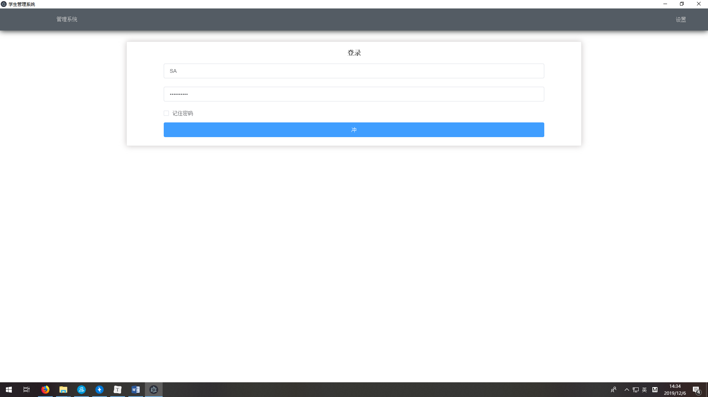
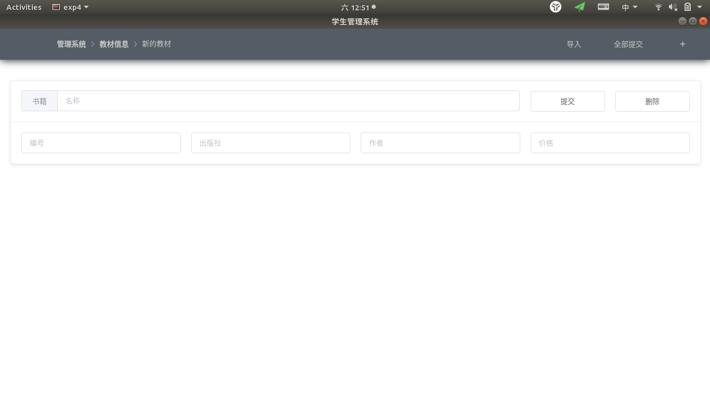
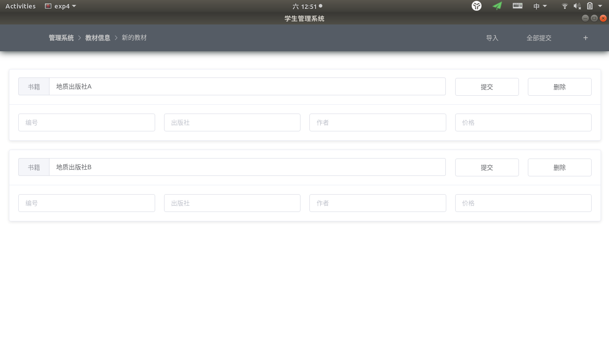
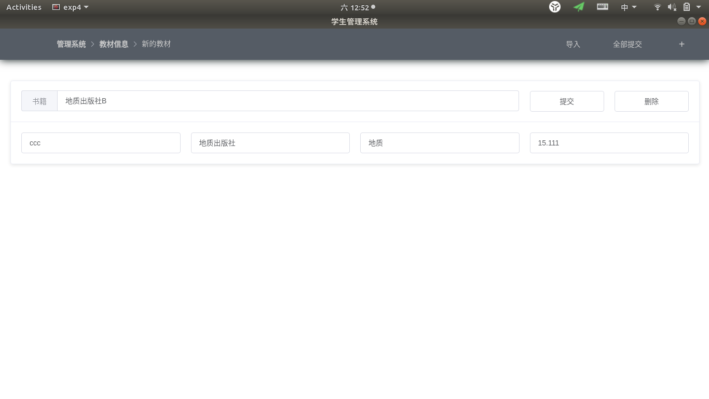
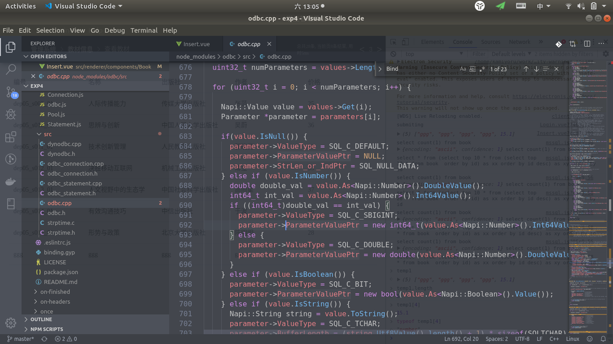

## 数据库实验第四次实验 - 接口实验

Myriad Dreamin 2017211279 2017211301

## 实验目的

- 通过实验了解通用数据库应用编程接口ODBC的基本原理和实现机制，熟悉主要的ODBC接口的语法和使用方法；
- 利用C语言(或其它支持ODBC接口的高级程序设计语言)编程实现简单的数据库应用程序，掌握基于ODBC的数据库访问的基本原理和方法。

## 实验平台及环境

- 系统: Ubuntu18.04 LTS
- 环境: Docker 18.09.7
- 数据库版本: Microsoft SQL Server 2017

## 实验内容

+ 本实验内容主要是如何通过数据库接口访问（包括增、删、改）数据库中的数据；
+ 要求能够通过编写程序或者使用SQL Server工具访问到数据，该实验的重点在于ODBC数据源配置和工具使用。

+ 在Windows控制面板中通过管理工具下的ODBC数据源工具在客户端新建连接到SQL Server服务器的ODBC数据源，测试通过后保存，注意名字应与应用程序中引用的数据源一致。

+ 编译程序并调试通过。

实验过程要求：


+ 以SQL语言相关内容为基础，课后查阅、自学ODBC接口有关内容，包括ODBC的体系结构、工作原理、数据访问过程、主要API接口的语法和使用方法等。
+ 以实验二建立的数据库为基础，编写 C语言(或其它支持ODBC接口的高级程序设计语言) 数据库应用程序，按照如下步骤访问数据库：
    + ODBC初始化，为ODBC分配环境句柄；
    + 建立应用程序与ODBC数据源的连接；
    + 实现数据库应用程序对数据库中表的数据查询、修改、删除、插入等操作。
    + 结束数据库应用程序。

由于不是程序设计练习，因此针对一张表进行操作，即可完成基本要求。

若程序结构和功能完整，界面友好，可适当增加分数。

实验相关语句要求：

+ 所编写的数据库访问应用程序应使用到以下主要的ODBC API函数：
    + SQLALLocEnv：初始化ODBC环境，返回环境句柄；
    + SQLALLocConnect：为连接句柄分配内存并返回连接句柄；

    + SQLConnect：连接一个SQL数据资源；

    + SQLDriverConnect：连接一个SQL数据资源，允许驱动器向用户询问信息；
    + SQLALLocStmt：为语句句柄分配内存, 并返回语句句柄；
    + SQLExecDirect：把SQL语句送到数据库服务器，请求执行由SQL语句定义的数据库访问；

    + SQLFetchAdvances：将游标移动到查询结果集的下一行(或第一行)；

    + SQLGetData：按照游标指向的位置，从查询结果集的特定的一列取回数据；

    + SQLFreeStmt：释放与语句句柄相关的资源；
    + SQLDisconnect：切断连接；
    + SQLFreeConnect：释放与连接句柄相关的资源；

    + SQLFreeEnv：释放与环境句柄相关的资源。

## 实验步骤

#### 使用Javascript与c++ ODBC交互

本次实验使用的宿主语言是`Javascript`，但是，底层仍然基于`c++ ODBC`

每次启动程序时，都使用下面的函数初始化环境：

```cpp
Napi::Value ODBC::Init(Napi::Env env, Napi::Object exports) {

  hEnv = NULL;
  Napi::HandleScope scope(env);

  // Wrap ODBC constants in an object that we can then expand
  std::vector<Napi::PropertyDescriptor> ODBC_CONSTANTS;

  ODBC_CONSTANTS.push_back(Napi::PropertyDescriptor::Value("ODBCVER", Napi::Number::New(env, ODBCVER), napi_enumerable));
	
  // 省略Javascript常数设定
  ...
  ODBC_CONSTANTS.push_back(Napi::PropertyDescriptor::Value("SQL_NULLABLE_UNKNOWN", Napi::Number::New(env, SQL_NULLABLE_UNKNOWN), napi_enumerable));

  exports.DefineProperties(ODBC_CONSTANTS);

  exports.Set("connect", Napi::Function::New(env, ODBC::Connect));

  // 初始化一个全局的互斥锁
  uv_mutex_init(&ODBC::g_odbcMutex);

  uv_mutex_lock(&ODBC::g_odbcMutex);
  // 初始化odbc环境句柄
  SQLRETURN sqlReturnCode = SQLAllocHandle(SQL_HANDLE_ENV, SQL_NULL_HANDLE, &hEnv);
  uv_mutex_unlock(&ODBC::g_odbcMutex);

  if (!SQL_SUCCEEDED(sqlReturnCode)) {
    DEBUG_PRINTF("ODBC::New - ERROR ALLOCATING ENV HANDLE!!\n");
    Napi::Error(env, Napi::String::New(env, ODBC::GetSQLError(SQL_HANDLE_ENV, hEnv))).ThrowAsJavaScriptException();
    return env.Null();
  }

  // 设置odbc环境
  SQLSetEnvAttr(hEnv, SQL_ATTR_ODBC_VERSION, (SQLPOINTER) SQL_OV_ODBC3, SQL_IS_UINTEGER);

  return exports;
}
```

当程序结束（类生命周期结束）时，下面的函数会被调用，类似的，连接和句柄的生命周期(在`javascript`中)结束时，它们的handler也会被自动释放。

```c++
ODBC::~ODBC() {
  DEBUG_PRINTF("ODBC::~ODBC\n");

  uv_mutex_lock(&ODBC::g_odbcMutex);

  if (hEnv) {
    // 释放环境句柄
    SQLFreeHandle(SQL_HANDLE_ENV, hEnv);
    hEnv = NULL;
  }

  uv_mutex_unlock(&ODBC::g_odbcMutex);
}
```

所有的连接都会以异步的形式被连接：

```c++
/*
 * ConnectAsyncWorker: 初始化连接的工作器public继承Nodejs的异步工作器
 */
class ConnectAsyncWorker : public Napi::AsyncWorker {
	// ()
    ...
    void Execute() {

      DEBUG_PRINTF("ODBC::ConnectAsyncWorker::Execute\n");

      uv_mutex_lock(&ODBC::g_odbcMutex);

      sqlReturnCode = SQLAllocHandle(
        SQL_HANDLE_DBC,
        hEnv,
        &hDBC);

      if (connectionTimeout > 0) {
        sqlReturnCode = SQLSetConnectAttr(
          hDBC,                                   // ConnectionHandle
          SQL_ATTR_CONNECTION_TIMEOUT,            // Attribute
          (SQLPOINTER) size_t(connectionTimeout), // ValuePtr
          SQL_IS_UINTEGER);                       // StringLength
      }
      
      if (loginTimeout > 0) {
        sqlReturnCode = SQLSetConnectAttr(
          hDBC,                              // ConnectionHandle
          SQL_ATTR_LOGIN_TIMEOUT,            // Attribute
          (SQLPOINTER) size_t(loginTimeout), // ValuePtr
          SQL_IS_UINTEGER);                  // StringLength
      }

      // 题目要求的连接方式
      sqlReturnCode = SQLDriverConnect(
        hDBC,                 // ConnectionHandle
        NULL,                 // WindowHandle
        connectionStringPtr,  // InConnectionString
        SQL_NTS,              // StringLength1
        NULL,                 // OutConnectionString
        0,                    // BufferLength - in characters
        NULL,                 // StringLength2Ptr
        SQL_DRIVER_NOPROMPT); // DriverCompletion

      uv_mutex_unlock(&ODBC::g_odbcMutex);
      ASYNC_WORKER_CHECK_CODE_SET_ERROR_RETURN(sqlReturnCode, SQL_HANDLE_DBC, hDBC, "ConnectAsyncWorker::Execute", "SQLDriverConnect");
    }
	...
};
```

所有的语句(statement)都以异步的方式被创建:

```c++
class CreateStatementAsyncWorker : public Napi::AsyncWorker {

  private:
    ODBCConnection *odbcConnectionObject;
    SQLRETURN sqlReturnCode;
    HSTMT hSTMT;

    void Execute() {

      DEBUG_PRINTF("ODBCConnection::CreateStatementAsyncWorker:Execute - hDBC=%p hDBC=%p\n",
       odbcConnectionObject->hENV,
       odbcConnectionObject->hDBC
      );

      uv_mutex_lock(&ODBC::g_odbcMutex);
      // 创建语句句柄
      sqlReturnCode = SQLAllocHandle(
        SQL_HANDLE_STMT,            // HandleType
        odbcConnectionObject->hDBC, // InputHandle
        &hSTMT                      // OutputHandlePtr
      );
      uv_mutex_unlock(&ODBC::g_odbcMutex);
      ASYNC_WORKER_CHECK_CODE_SET_ERROR_RETURN(sqlReturnCode, SQL_HANDLE_DBC, odbcConnectionObject->hDBC, "CreateStatementAsyncWorker::Execute", "SQLAllocHandle");
    }
	...
};
```

执行语句使用`SQLExecute`函数

```c++
    void Execute() {

      DEBUG_PRINTF("ODBCStatement::ExecuteAsyncWorker::Execute\n");

      data->sqlReturnCode = SQLExecute(
        data->hSTMT // StatementHandle
      );
      ASYNC_WORKER_CHECK_CODE_SET_ERROR_RETURN(data->sqlReturnCode, SQL_HANDLE_STMT, data->hSTMT, "ExecuteAsyncWorker::Execute", "SQLExecute");

      data->sqlReturnCode = ODBC::RetrieveResultSet(data);
      ASYNC_WORKER_CHECK_CODE_SET_ERROR_RETURN(data->sqlReturnCode, SQL_HANDLE_STMT, data->hSTMT, "ExecuteAsyncWorker::Execute", "---");
    }
```


抓取数据以`limit`语句的限制分多次用`fetchall`从数据库中获取

```c++
SQLRETURN ODBC::FetchAll(QueryData *data) {

  SQLRETURN returnCode;
  
  // 多次用statement获取全部结果集
  while(SQL_SUCCEEDED(returnCode = SQLFetch(data->hSTMT))) {

    ColumnData *row = new ColumnData[data->columnCount];

    for (int i = 0; i < data->columnCount; i++) {

      row[i].size = data->columns[i]->StrLen_or_IndPtr;
      if (row[i].size == SQL_NULL_DATA) {
        row[i].data = NULL;
      } else {
        row[i].data = new SQLCHAR[row[i].size];
        memcpy(row[i].data, data->boundRow[i], row[i].size);
      }
    }

    data->storedRows.push_back(row);
  }

  // will return either SQL_ERROR or SQL_NO_DATA
  SQLCloseCursor(data->hSTMT);
  return returnCode;
}
```

在`javascript`中，对需求进一步封装。下面给出一个连接，关闭和查询的例子。

连接：

```javascript
	async connect(uid, pwd, dsn = 'stmssql') {
        if (!((typeof(uid).toString() === 'string') && (typeof(pwd).toString() === 'string') && (typeof(dsn).toString() === 'string'))) {
            window.console.log('bad uid, pwd, dsn arg');
            return;
        }

        if (this.db != null) {
            await this.close();
            this.isLogin = false;
        }
        // 创建一个连接池模板，实质没有创建任何连接，但是初始化了环境
        this.db = await odbc.pool('DSN=' + dsn +  '; UID=' + uid + ';PWD=' + pwd + ';Client_CSet=CP936');
        this.isLogin = true;
    }
```

关闭：

```javascript
    async close() {
        if (this.db != null) {
			//释放环境资源
            await this.db.close();
            this.db = null;
            this.isLogin = false;
        }
    }
```

查询：

```javascript
	
    async query(pageCount, pageNumber=1, whereStmt='') {
        window.jjj = jschardet;
        window.ic = iconv;
        if (typeof whereStmt != 'string') {
            whereStmt = '';
        }
        //从池子中获取一个连接，如果连接数量不够并且池子的连接上限还有空余，调用ConnectAsyncWorker.Execute创建一个连接
        const connection = await this.db.connect();
        let all_count_stmt = 'select count(1) from book ' + whereStmt;
        let bookCount = (await connection.query(iconv.decode(iconv.encode(all_count_stmt, 'utf-8'), 'utf-8')))[0][''];
        let all_stmt = 'select * from (select top '+ Math.min(pageCount, pageCount + bookCount - pageNumber * pageCount).toString() +' * from (select top ' + (pageNumber * pageCount).toString() + ' * from book ' + whereStmt + ' order by id) as xx order by id desc) as xy order by id';
        let bookInfos = await connection.query(all_stmt);
        //实际上是返回到了池子中，如果一段时间没有再次被拉取出来，调用 CloseAsyncWorker.Execute
		await connection.close();
        return {bookCount, bookInfos};
    }
```

这样的`sql`业务函数还有很多个。而剩下有很多代码都着重编写`GUI`不再展示。

#### 程序展示

本程序在windows和linux上均可运行，但在windows上需要解决一定兼容性问题，比如链接`odbccp32.lib`。

打开运行如下：


由于记住了密码。按下登出键，如下：



可以在设置中配置DSN和密码保存路径，注意把路径设为`400`（如果在windows下，则禁用权限继承并只允许自己访问）


进入管理系统后，是第一级管理系统。


以教材信息为例，进入二级菜单后，可以根据需求进入不同的页面。


查询页面如下，右上角有左右箭头用于翻页。并记录了查询消耗时间，总记录条数。


插入页面如下，单个插入条目允许设置书籍，编号，出版社，作者，价格等。



允许点击右上角的`+`添加一个条目。



每个条目都可以单独地删除，或提交。


如果填入的信息发生错误，目前是将错误直接返回，弹出消息提示框并提示。


现在尝试插入一条信息



在查询界面中可以看到刚刚插入的条目。


来看更新界面。


点击对应框，可以开启或关闭对应的输入。点击右上角的过滤，可以查看被筛选到的数据，防止更新发生差错。


不同的查询条件之间是以`and`形式连接的。


现在更新被筛选到的信息，将其的定价更新为15元。


更新成功。


删除界面与更新界面基本一样，就不详细介绍了。


本实验使用的是第三方的javascript odbc库，底层仍然使用的是c语言的odbc接口。这个第三方库有一些小bug，但稍微跟踪一下，就能修复。

下面介绍一个已知并被我修复的bug。



将690行代码修改如下，可以修复js odbc绑定sql字段丢失浮点数精度的问题。


## 实验小结

odbc是近10年前的技术，已经基本没人维护了。这次实验的主要时间耗费在寻找合适的odbc第三方库，并且大部分第三方库都不可靠。不过经过一定时间的努力，最终还是成功在linux上完成了此次实验。

在实验中也遇到了很多问题，但大部分都不是数据库技术的问题。比如编码的问题，最终，只能以在linux中默认为utf8不乱码结束。再比如产生丢失精度的问题，最终以追根溯源发现第三方库的bug结束。

花费了大约一天时间解决了环境问题，剩下的就很简单了。连接odbc都是符合平时连接各种数据库的习惯api，并没有不舒适的地方。

在此次实验中，我最大的收获就是解决了在未知问题下通过黑盒测试推测bug产生位置从而定位并解决bug的能力。

同时，我给出对此次实验的建议。希望老师不要限制数据库连接的方式，相反，而是要求着重让同学能够把以不同的方式正确并有效连接数据库的过程描述清楚。比如，在连接数据库上，js有第三方比较优秀的直接连接sql-server的方式，通过另外一种方式，此次实验就能轻松很多。