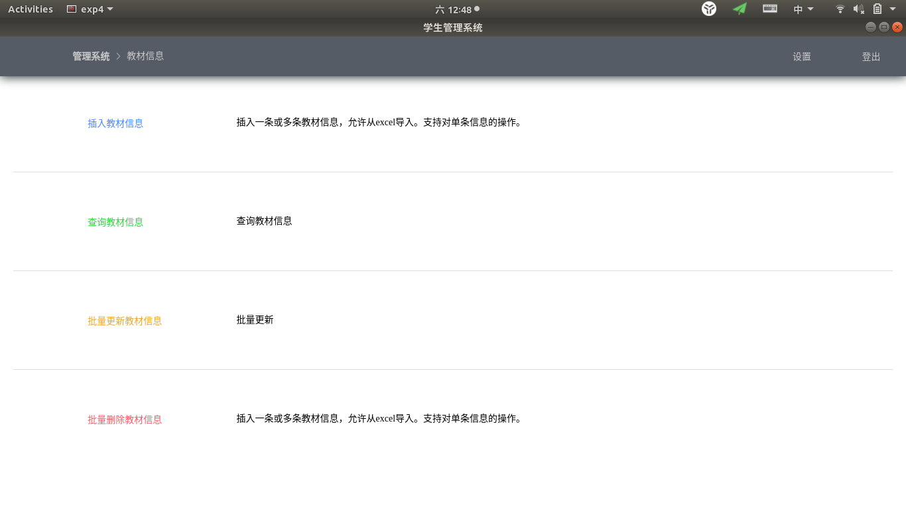
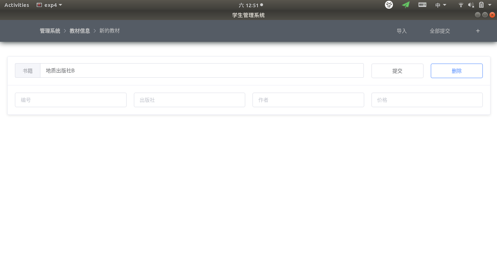
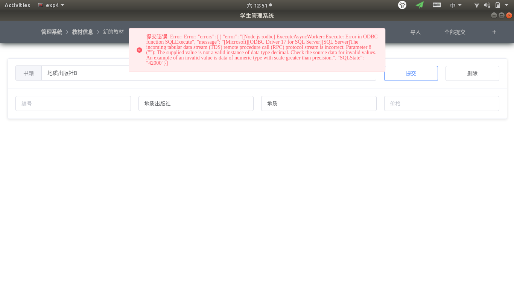
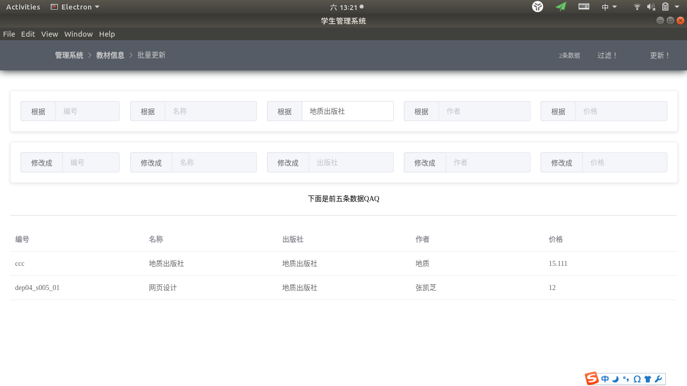
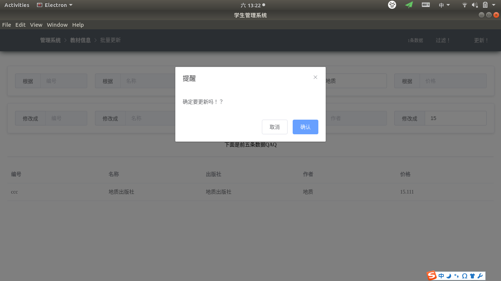
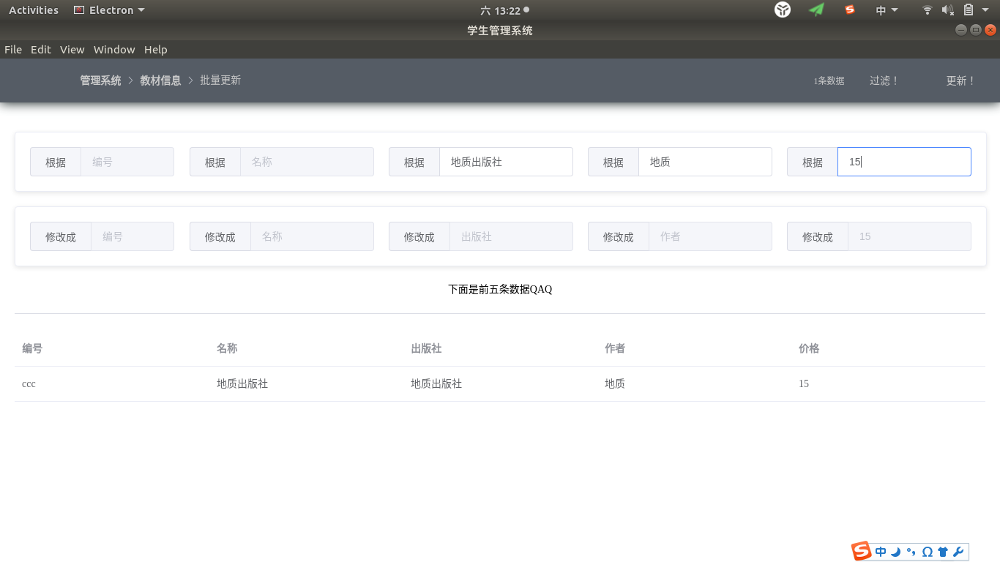
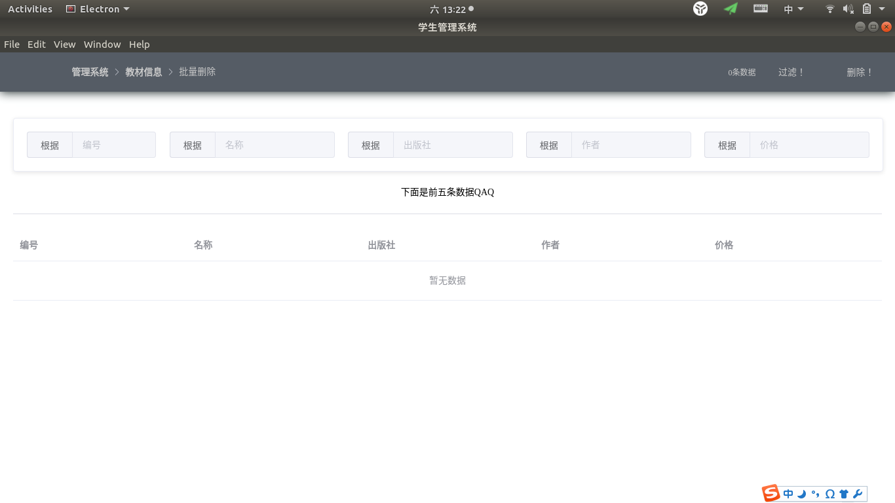
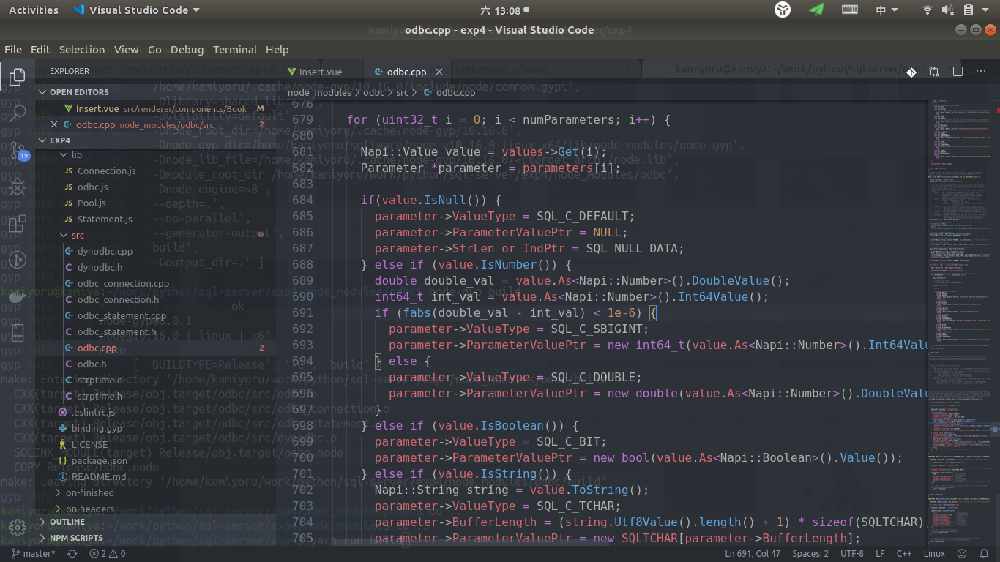

## 数据库实验第三次实验

Myriad Dreamin 2017211279 2017211301

## 实验目的

- 通过实验了解通用数据库应用编程接口ODBC的基本原理和实现机制，熟悉主要的ODBC接口的语法和使用方法；
- 利用C语言(或其它支持ODBC接口的高级程序设计语言)编程实现简单的数据库应用程序，掌握基于ODBC的数据库访问的基本原理和方法。

## 实验平台及环境

- 系统: Ubuntu18.04 LTS
- 环境: Docker 18.09.7
- 数据库版本: Microsoft SQL Server 2017

## 实验内容

+ 本实验内容主要是如何通过数据库接口访问（包括增、删、改）数据库中的数据；
+ 要求能够通过编写程序或者使用SQL Server工具访问到数据，该实验的重点在于ODBC数据源配置和工具使用。

+ 在Windows控制面板中通过管理工具下的ODBC数据源工具在客户端新建连接到SQL Server服务器的ODBC数据源，测试通过后保存，注意名字应与应用程序中引用的数据源一致。

+ 编译程序并调试通过。

实验过程要求：

+ 以SQL语言相关内容为基础，课后查阅、自学ODBC接口有关内容，包括ODBC的体系结构、工作原理、数据访问过程、主要API接口的语法和使用方法等。
+ 以实验二建立的数据库为基础，编写 C语言(或其它支持ODBC接口的高级程序设计语言) 数据库应用程序，按照如下步骤访问数据库：
    + ODBC初始化，为ODBC分配环境句柄；
    + 建立应用程序与ODBC数据源的连接；
    + 实现数据库应用程序对数据库中表的数据查询、修改、删除、插入等操作。
    + 结束数据库应用程序。

由于不是程序设计练习，因此针对一张表进行操作，即可完成基本要求。

若程序结构和功能完整，界面友好，可适当增加分数。

实验相关语句要求：

+ 所编写的数据库访问应用程序应使用到以下主要的ODBC API函数：
    + SQLALLocEnv：初始化ODBC环境，返回环境句柄；
    + SQLALLocConnect：为连接句柄分配内存并返回连接句柄；

    + SQLConnect：连接一个SQL数据资源；

    + SQLDriverConnect：连接一个SQL数据资源，允许驱动器向用户询问信息；
    + SQLALLocStmt：为语句句柄分配内存, 并返回语句句柄；
    + SQLExecDirect：把SQL语句送到数据库服务器，请求执行由SQL语句定义的数据库访问；

    + SQLFetchAdvances：将游标移动到查询结果集的下一行(或第一行)；

    + SQLGetData：按照游标指向的位置，从查询结果集的特定的一列取回数据；

    + SQLFreeStmt：释放与语句句柄相关的资源；
    + SQLDisconnect：切断连接；
    + SQLFreeConnect：释放与连接句柄相关的资源；

    + SQLFreeEnv：释放与环境句柄相关的资源。

## 实验步骤

本程序在windows和linux上均可运行，但在windows上需要解决一定兼容性问题，比如链接`odbccp32.lib`。

打开运行如下：

由于记住了密码。按下登出键，如下：

可以在设置中配置DSN和密码保存路径，注意把路径设为`400`（如果在windows下，则禁用权限继承并只允许自己访问）

进入管理系统后，是第一级管理系统。

以教材信息为例，进入二级菜单后，可以根据需求进入不同的页面。

查询页面如下，右上角有左右箭头用于翻页。并记录了查询消耗时间，总记录条数。

插入页面如下，单个插入条目允许设置书籍，编号，出版社，作者，价格等。

允许点击右上角的`+`添加一个条目。

每个条目都可以单独地删除，或提交。

如果填入的信息发生错误，目前是将错误直接返回，弹出消息提示框并提示。

现在尝试插入一条信息

在查询界面中可以看到刚刚插入的条目。

来看更新界面。

点击对应框，可以开启或关闭对应的输入。点击右上角的过滤，可以查看被筛选到的数据，防止更新发生差错。

不同的查询条件之间是以`and`形式连接的。

现在更新被筛选到的信息，将其的定价更新为15元。

更新成功。

删除界面与更新界面基本一样，就不详细介绍了。

本实验使用的是第三方的javascript odbc库，底层仍然使用的是c语言的odbc接口。这个第三方库有一些小bug，但稍微跟踪一下，就能修复。

下面介绍一个已知并被我修复的bug。

将690行代码修改如下，可以修复js odbc绑定sql字段丢失浮点数精度的问题。

## 实验小结

odbc是近10年前的技术，已经基本没人维护了。这次实验的主要时间耗费在寻找合适的odbc第三方库，并且大部分第三方库都不可靠。不过经过一定时间的努力，最终还是成功在linux上完成了此次实验。